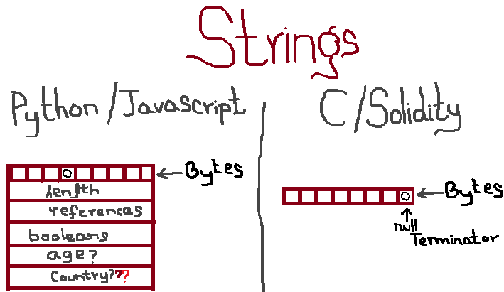

# The Terminator Trick With Solidity Strings


In the course of programming in Solidity, you will want to interact with strings early on. After all, strings are the most interesting data types to interact with, and the most helpful, when you want to debug your programs.

As a programmer, you likely know how strings work already. Sure, solidity is more C-like in that it doesn't have the nice javascript/python string functions like length, concatenation, etcetera, but it's just about that, right? Nothing unexpected? We will see C !

First, lets go through the official documentation, and see what it has to say on strings. The available documentation on strings is relatively limited. On the page for data types in Solidity, under the sub-heading of 'Dynamically-sized byte arrays', the documentation says the following:

http://solidity.readthedocs.io/en/develop/types.html


#### Dynamically-sized byte array
```
string:
    Dynamically-sized UTF-8-encoded string, see Arrays. Not a value-type!

As a rule of thumb, use bytes for arbitrary-length raw byte data and string for arbitrary-length string (UTF-8) data.
```

Okay. What do we know from this? That strings are dynamic byte arrays, and it's (probably) not a good idea to store raw bytes in there. But of course, we're experienced programmers, why would we ever store raw bytes as strings anyway right?

Maybe we missed out some interesting behavior of arrays though? Since strings are also arrays, we should look into the documentation for arrays.

http://solidity.readthedocs.io/en/develop/types.html#arrays

`
Arrays can have a compile-time fixed size or they can be dynamic. For storage arrays, the element type can be arbitrary (i.e. also other arrays, mappings or structs). For memory arrays, it cannot be a mapping and has to be an ABI type if it is an argument of a publicly-visible function.
`

Nothing off or unexpected there. So let's see if we can do something unexpected here. A spoiler alert of sorts for C programmers: we will be testing how solidity handles string termination.

First, lets construct an interesting string to play with. 

Type the following lines in the console (browser or nodejs) and look at the result.
```
let str_arr = [ "A", "P", "P", "\u0000", "L", "E" ]
let joined_str = str_arr.join('');
console.log(joined_str)
console.log(str_arr.length)
```

It prints out "APPLE" but with a weird character in beterrn. Nothing outrageous there, right?


We see that the length of the string is six characters. All good there.

Now write the most basic solidity program to store and retrieve a string. Use the samples you have from previous chapters if you must! It can be as simple as the following. It won't work in its current form, but it's a good point to start from!

```
pragma solidity ^0.4.18;
contract test_string {

    string string_to_test;
    
    function set_string(string toset){
        string_to_test = toset;
    }
    
    function get_string() returns (string){
        return string_to_test;
    }
    
    function test_string(){
        string_to_test="";
    }
}
```

Now try setting the string in your contract to the string `joined_str`. Make sure it goes through, with no errors. Now retrieve it by using it the getter function. Print out its length. Print it out in the console. Make sure you sent in the expected string.


Uh oh!

We sent in one string to the setter, and it succefully set the value in the contract, with no errors. But now that when we're retrieving it, we get a different string! A shorter string, that's truncated right before the weird printed character. And we didn't get any warnings! What's happening?


The C programmers amongst you will realize that Solidity has null-terminated strings, without actually mentioning it anywhere in the documentation (and mentioning that strings are arrays at some point)! What that means is, whenever the virtual machine sees a character with the code of 0 (or a null string), it considers the string to have terminated, and stops reading beyond that point. Mind you, this happens without the documentation mentioning it anywhere -- Really -- search for 'null terminated' and "Solidity" on Google.

Once you give it some thought, you begin realizing that this is a very reasonable approach. After all -- you want to minimize the number of operations in the Ethereum Virtual Machine. So instead of keeping track of how long a string is, it considers the null character as the string terminator. Whereas high-level languages like javascript and python spend a lot of resources doing book-keeping for strings, Solidity on EVM is scrappy, and does none of it! Now that we know, it's all well and good, right?



Maybe not so! As of December 2017, Solidity is the most common EVM programming language, and the Web3 Javascript library is the most-commonly used library used to interact with the contracts. So when you're programming in Javascript, a programmer might expect strings in Solidity to behave fundamentally the same way as they do in Javascript. They'd be in a big surprise, though!

Lets come up with a scenario: someone's opened a service on the blockchain that you can claim user id's for -- a distributed application for Twitter, for example. When the user registers for a new account, the new proposed id needs to be validated to make sure the characters are allowed, and its not in use. If the validation happened at the server level (outside solidity), the program would check for the entire string, considering the null character as a valid character. But once the string moves into Solidity level, it gets terminated at the null-character, and potentially overwriting existing users! That is bad! The lesson here is, if you plan on doing any sort of validation in your programs, always, always do it at Solidity level, not at the server level, even if you believe you understand the language inside-out! Also, if you want to use strings in solidity, avoid using the primitive provided. If you must use libraries such as this: https://github.com/Arachnid/solidity-stringutils/blob/master/strings.sol . As of December 2017, it's probably going to be very expensive in the main chain, but it's a good idea to keep security in mind first! 

I want to discuss one more aspect of this behavior.

https://news.ycombinator.com/item?id=3906755
https://news.ycombinator.com/item?id=13973174
